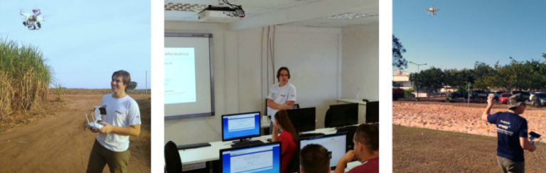
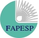

# About

@(Personal)[About]

I received my B.Sc. degree in Computer Information Systems and my M.Sc. degree in Computer Science from the University of São Paulo in 2009 and 2011, respectively, where I also received my Ph.D. in Computer Science in 2015. I was associated with BioCom (Laboratório de Computação Bioinspirada) and LAPaD (Laboratório de Análise de Padrões em Dados) in the Institute of Mathematics and Computer Sciences (ICMC), University of São Paulo (USP) at São Carlos/Brazil.

Since 2016, I have been with the School of Sciences and Engineering (FCE) of the São Paulo State University (UNESP/Tupã), where I am currently as an Associate Professor at Biosystems Engineering Department (DEB). Currently, I am a member of the laboratory SINACI ([Sistemas Não-Clássicos Aplicados à Computação Inteligente](http://www.sinaci.com.br/)) and the [Hub for Artificial Intelligence and Cognitive Architectures](https://hiaac.unicamp.br/en/) (H.IAAC), where I’m working on the line of learning in Cognitive Architectures.

I won 1st place in the X Competition of Thesis and Dissertations in Artificial and Computational Intelligence at the 5th Brazilian Conference on Intelligent System (BRACIS 2016).

My main interests are in Machine Learning (e.g., Semi-supervised Learning, Ensembles, Classification, and Clustering), including those Bio-inspired Computing techniques (e.g., Evolutionary and Genetic Algorithms, and shallow/deep Artificial Neural Networks: MLPs, CNNs, GANs, etc.), Computer Vision, and Data Science (Predictive Analytics, Big Data, etc.).

Because of my [research](https://bv.fapesp.br/pt/auxilios/99479/deteccao-de-padroes-em-plantacoes-a-partir-da-combinacao-de-classificadores-e-agrupadores-de-dados/) on Agriculture 4.0/5.0 involving crop monitoring for threat detection, I have become a drone pilot!

For more information on my research and teaching please visit my CV Lattes (in Portuguese) or access the links below:

                  

